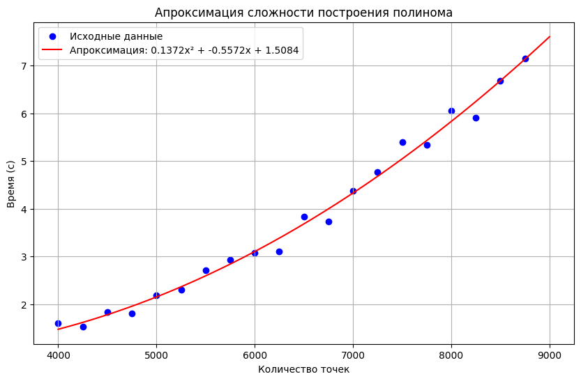
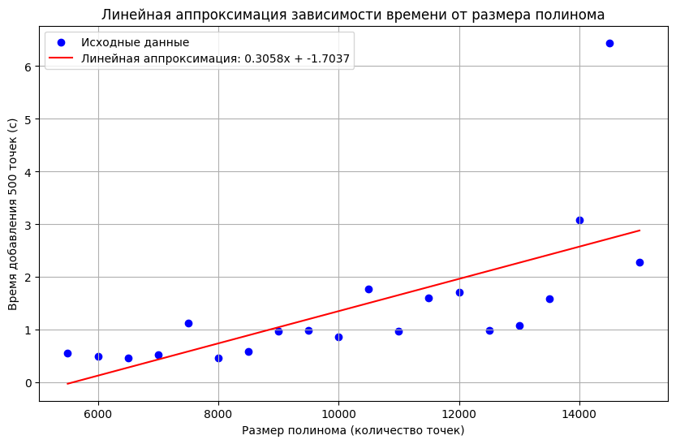

# Лабораторная работа №1

- [Исходное задание](docs/Лабораторная%20работа%201.pdf) (pdf)

## Произвольный полином `Polynomial`

Тут все просто, без пояснений

## Интерполяционный полином `InterpolatingPolynomial`
### Ключевые идеи

- Кэширование функции нахождения разделённой разности `InterpolatingPolynomial.dividedDifference` и `InterpolatingPolynomial.computeDividedDifference`
  - Это должно быть аналогично построению таблицы разделенных разностей Ньютона
- Хранение последнего полинома-произведения скобок (x - x1)...(x - xi) `InterpolatingPolynomial.currentBracketPolynomial`

### Результаты нагрузочного теста

#### Результаты инициализации интерполяционного полинома `InterpolatingPolynomialLoadTest.testComplex`

Эталонная сложность - O(n²)  
Сложность реализованного алгоритма - O(n³)  

#### Результаты добавления новых точек к полиному `InterpolatingPolynomialLoadTest.testAddPoints`

Эталонная сложность - O(n)  
Сложность реализованного алгоритма - O(n²)  

#### Основная проблема

Особенность:
- На каждой итерации я строю обычный полином

Решение:
- Использование таблицы разделенных разностей при вычислениях
- Вычисление конечного полинома в конце

### Математика алгоритмов

#### Интерполяционный полином Ньютона

##### Полином Ньютона

Интерполяционный полином Ньютона в форме разделённых разностей:

$$ P_n(x) = f[x_0] + f[x_0, x_1](x - x_0) + f[x_0, x_1, x_2](x - x_0)(x - x_1) + \dots + f[x_0, x_1, \dots, x_n](x - x_0)(x - x_1) \dots (x - x_{n-1}) $$

Где:
- $ f[x_0] = f(x_0) $ — значение функции в начальной точке.
- $ f[x_0, x_1] $, $ f[x_0, x_1, x_2] $, ..., $ f[x_0, x_1, ..., x_n] $ — разделённые разности.

Этот полином используется для построения интерполяции функции по заданному набору точек.

##### Формулы разделённых разностей

Разделённые разности первого порядка:

$$ f[x_i, x_{i+1}] = \frac{f(x_{i+1}) - f(x_i)}{x_{i+1} - x_i} $$

Разделённые разности второго порядка:

$$ f[x_i, x_{i+1}, x_{i+2}] = \frac{f[x_{i+1}, x_{i+2}] - f[x_i, x_{i+1}]}{x_{i+2} - x_i} $$

Разделённые разности третьего порядка:

$$ f[x_i, x_{i+1}, x_{i+2}, x_{i+3}] = \frac{f[x_{i+1}, x_{i+2}, x_{i+3}] - f[x_i, x_{i+1}, x_{i+2}]}{x_{i+3} - x_i} $$

И так далее.
